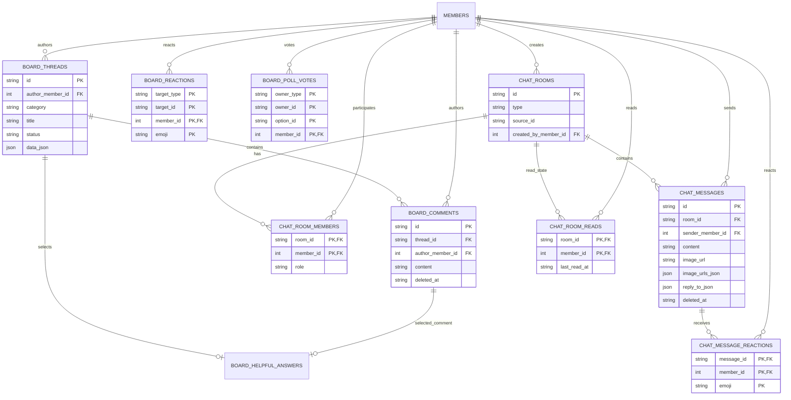
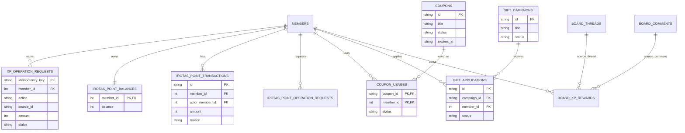
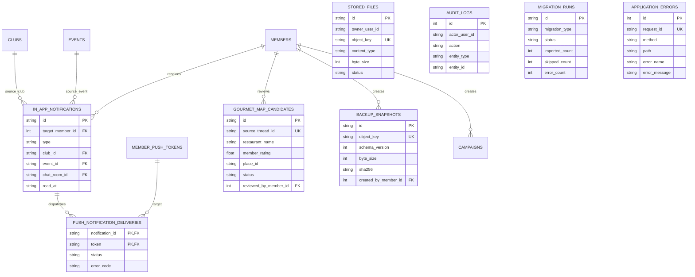

# IRO+ データベース論理モデル

更新日: 2026-10-02

この図は`drizzle/0000`から`0069`までのMigrationを、業務ドメイン単位に整理した論理モデルである。SQLite/D1の全カラムを列挙する物理モデルではなく、主要エンティティと関係を示す。

各`status`、決済状態、募集状態の値と遷移は、[状態遷移・イベントライフサイクル・権限・多重操作監査](state-transitions-event-lifecycle-permissions.md)に分離している。

## 1. 会員・認証・部活動

```mermaid
erDiagram
    MEMBERS ||--o{ MEMBER_SESSIONS : has
    MEMBERS ||--o{ MEMBER_SUBSCRIPTIONS : linked_to
    MEMBERS ||--|| MEMBER_ID_ASSIGNMENTS : receives
    MEMBERS ||--o{ MEMBER_PRIVATE_NOTES : owns
    MEMBERS ||--o{ MEMBER_PRIVATE_NOTES : target
    MEMBERS ||--o{ MEMBER_FOLLOWS : follows
    MEMBERS ||--o{ MEMBER_FOLLOWS : followed_by
    MEMBERS ||--o{ CLUB_MEMBERSHIPS : joins
    MEMBERS ||--o{ CLUBS : leads
    CLUBS ||--o{ CLUB_MEMBERSHIPS : has
    MEMBERS ||--o{ ACCOUNT_DELETION_REQUESTS : requests
    MEMBERS ||--o| WITHDRAWN_MEMBER_SNAPSHOTS : retained_as
    MEMBERS ||--o{ MEMBER_STATUS_HISTORY : changes
    MEMBERS ||--|| MEMBER_START_MISSION_STATE : owns
    MEMBERS ||--o{ MEMBER_START_MISSION_REWARDS : earns
    MEMBERS ||--o{ MEMBER_PUSH_TOKENS : registers

    MEMBERS {
      int id PK
      string email UK
      string public_member_id
      string user_handle UK
      string display_name
      string account_status
      string member_rank
      int xp
      string access_role
      json profile_json
    }
    MEMBER_SUBSCRIPTIONS {
      int id PK
      int member_id FK
      string square_customer_id
      string square_subscription_id
      string access_status
      string paid_until_date
    }
    MEMBER_SESSIONS {
      string token_hash PK
      int member_id FK
      string expires_at
    }
    CLUBS {
      string id PK
      string name
      int leader_member_id FK
      string status
    }
    CLUB_MEMBERSHIPS {
      string club_id PK, FK
      int member_id PK, FK
      string status
      int decided_by_member_id FK
    }
    ACCOUNT_DELETION_REQUESTS {
      string id PK
      int member_id FK
      string request_type
      string status
      string scheduled_for
    }
    WITHDRAWN_MEMBER_SNAPSHOTS {
      int member_id PK, FK
      string email
      string display_name
      json profile_json
      string retained_at
    }
    MEMBER_STATUS_HISTORY {
      int id PK
      int member_id FK
      string status_type
      string previous_status
      string new_status
      string changed_at
    }
    MEMBER_START_MISSION_STATE {
      int member_id PK, FK
      string guide_seen_at
    }
    MEMBER_START_MISSION_REWARDS {
      int member_id PK, FK
      string mission_key PK
      string grant_id
      string status
    }
    MEMBER_PUSH_TOKENS {
      string token PK
      int member_id FK
      string platform
      json preferences_json
    }
```

退会完了時は`members`を削除しない。表示用の`members`は「退会済みユーザー」へ匿名化する前に、元の会員情報をAPI非公開の`withdrawn_member_snapshots`へ保存する。投稿・イベント等の外部キーを維持し、フォロー・個人メモも保持する。認証セッションと未使用認証コードだけはアクセス遮断のため失効させる。`members.account_status`と`member_subscriptions.access_status`の変更は、DBトリガーで`member_status_history`へ変更前・変更後・変更日時を保存する。

## 2. 掲示板・チャット

## 3. イベント・申込・決済

```mermaid
erDiagram
    MEMBERS ||--o{ EVENTS : organizes
    EVENTS ||--o{ EVENT_PARTICIPATIONS : receives
    MEMBERS ||--o{ EVENT_PARTICIPATIONS : applies
    EVENTS ||--o{ EVENT_FAVORITES : receives
    MEMBERS ||--o{ EVENT_FAVORITES : marks
    EVENTS ||--o{ EVENT_CANCELLATION_REQUESTS : has
    MEMBERS ||--o{ EVENT_CANCELLATION_REQUESTS : requests
    EVENTS ||--o{ EVENT_COMMENTS : has
    MEMBERS ||--o{ EVENT_COMMENTS : authors
    EVENT_COMMENTS ||--o{ EVENT_COMMENT_REACTIONS : receives
    MEMBERS ||--o{ EVENT_COMMENT_REACTIONS : reacts
    EVENTS ||--o{ EVENT_PAYMENT_CHECKOUTS : has
    MEMBERS ||--o{ EVENT_PAYMENT_CHECKOUTS : pays
    EVENTS ||--o{ EVENT_ATTENDANCE_CONFIRMATIONS : records
    MEMBERS ||--o{ EVENT_ATTENDANCE_CONFIRMATIONS : attends
    EVENTS ||--|| EVENT_ATTENDANCE_FINALIZATIONS : finalizes
    EVENTS ||--o{ EVENT_XP_REWARDS : grants
    MEMBERS ||--o{ EVENT_XP_REWARDS : earns
    EVENTS ||--o{ EVENT_FEEDBACK_RESPONSES : receives
    MEMBERS ||--o{ EVENT_FEEDBACK_RESPONSES : submits
    EVENTS ||--o| EVENT_IMPORT_SOURCES : imported_from
    EVENTS ||--o{ EVENT_IMPORT_FIELD_EDITS : protects
    EVENTS ||--o{ EVENT_IMPORT_CONFLICTS : conflicts
    EVENTS ||--o{ EVENT_POINT_USAGES : discounts
    MEMBERS ||--o{ EVENT_POINT_USAGES : uses

    EVENTS {
      string id PK
      int organizer_member_id FK
      string title
      string event_date
      string status
      string event_type
      int capacity
      json public_data_json
    }
    EVENT_PARTICIPATIONS {
      string event_id PK, FK
      int member_id PK, FK
      string status
      string payment_state
    }
    EVENT_CANCELLATION_REQUESTS {
      string id PK
      string event_id FK
      int member_id FK
      string status
      int reviewed_by_member_id FK
    }
    EVENT_COMMENTS {
      string id PK
      string event_id FK
      int author_member_id FK
      string content
      string deleted_at
    }
    EVENT_PAYMENT_CHECKOUTS {
      string id PK
      string event_id FK
      int member_id FK
      int amount_yen
      int points_used
      string status
      string square_order_id UK
      string square_payment_id UK
    }
    EVENT_ATTENDANCE_CONFIRMATIONS {
      string event_id PK, FK
      int member_id PK, FK
      string status
      int confirmed_by_member_id FK
    }
    EVENT_XP_REWARDS {
      string id PK
      int member_id FK
      string event_id FK
      string action
      int amount
      string status
    }
    EVENT_FEEDBACK_RESPONSES {
      string id PK
      string event_id FK
      int member_id FK
      int overall_rating
      string comment
    }
    EVENT_IMPORT_SOURCES {
      string event_id PK, FK
      string source_thread_id UK
      json source_data_json
    }
```

## 4. XP・ポイント・特典

## 5. 通知・グルメマップ・運用

## 6. 補足

- `profile_json`、`public_data_json`、`data_json`など、一部の業務属性はJSONへ格納されている。
- 投票は掲示板とチャットのowner type / owner IDを使う多相関連があり、すべてが外部キーとして表現されているわけではない。
- `audit_logs.actor_user_id`、`stored_files.owner_user_id`などは文字列参照で、`members.id`へのDB外部キーではない。
- Discord移行・照合用テーブル、請求督促、審査状態、Google Maps API使用量などの補助テーブルは図を簡潔にするため一部省略している。
- 物理モデルを確定する場合は、全Migration適用後のD1から`sqlite_schema`と`PRAGMA foreign_key_list`を抽出し、自動生成した図と照合する。
