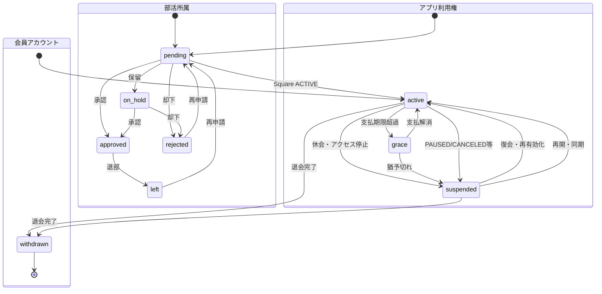
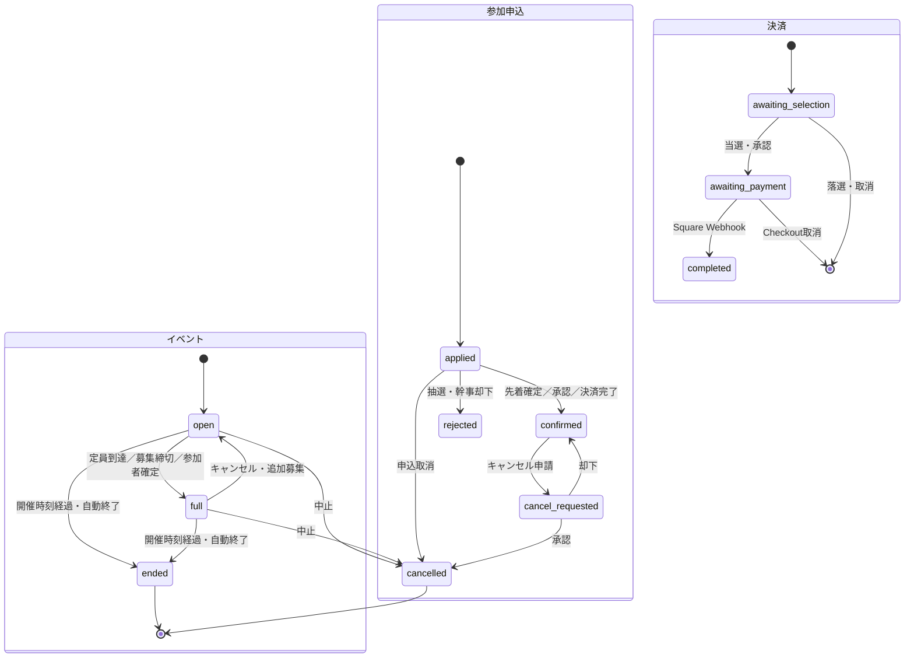
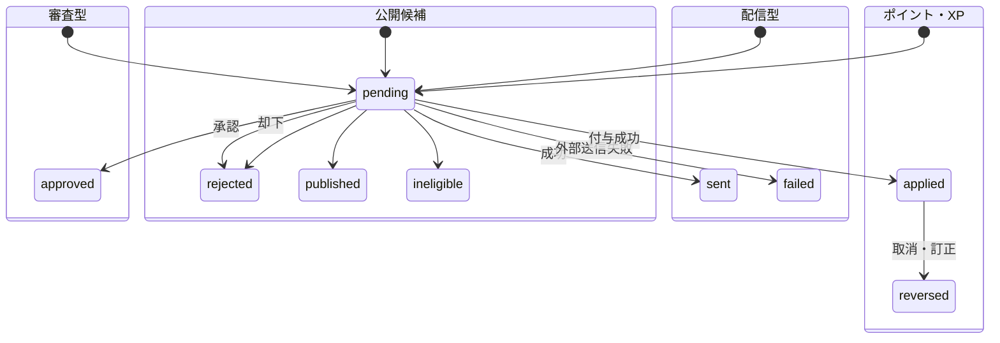
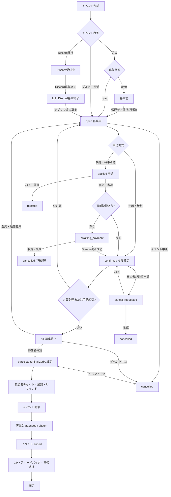

# IRO+ 状態遷移・イベントライフサイクル・権限・多重操作監査

更新日: 2026-10-02

## 1. 判定範囲

この資料は、`drizzle/0000`〜`0069`、`sites/`、`lib/`、`app/`の現行実装を静的に照合した結果である。

- `DB制約`: Migrationの`CHECK`、主キー、一意制約で保証される。
- `API制御`: APIハンドラの認証、権限、現在状態を条件にして保証される。
- `UI制御`: ボタン非活性化や処理中フラグだけ。APIより弱く、同一フレームの連打や複数端末には単独では耐えない。
- `JSON状態`: `events.public_data_json`等に保存され、DBの列制約では値を限定できない。

図にない任意の遷移を許可するという意味ではない。コードから正規の遷移を確認できない状態は、表で「要定義」とした。

## 2. ステータス項目の全件一覧

### 2.1 会員・認証・部活

| エンティティ.項目 | 値 | 初期値 | 主な遷移 | 保証 |
| --- | --- | --- | --- | --- |
| `stored_files.status` | `pending`, `active`, `deleted` | `active` | pending→active→deleted | DB制約。復活遷移は未定義 |
| `members.role` | `user`, `operator`, `admin` | `user` | user→operator/admin、管理操作で変更 | DB制約＋管理API |
| `members.access_role` | `member`, `club_leader`, `operator`, `admin` | `member` | member→club_leader/operator/admin | DB制約＋管理API |
| `members.account_status` | `active`, `suspended`, `withdrawn` | `active` | active↔suspended、active/suspended→withdrawn | DB制約＋変更前後・変更時刻を`member_status_history`へ自動保存。withdrawnからの復帰は要定義 |
| `member_subscriptions.square_status` | `PENDING`, `ACTIVE`, `CANCELED`, `DEACTIVATED`, `PAUSED`, `COMPLETED`, `UNKNOWN` | `UNKNOWN` | Square同期結果に追随 | DB制約＋Square同期 |
| `member_subscriptions.billing_status` | 外部同期文字列（例: `OVERDUE`／`期限超過`） | `NULL` | Square・請求照合結果に追随 | DB値制約なし。正規化が必要 |
| `member_subscriptions.access_status` | `pending`, `active`, `grace`, `suspended` | `pending` | pending→active、active→grace/suspended、grace→active/suspended | DB制約＋請求判定＋変更前後・変更時刻を`member_status_history`へ自動保存 |
| `discord_access_role_assignments.status` | `pending`, `linked` | `pending` | pending→linked | DB制約 |
| `clubs.status` | `active`, `archived` | `active` | active↔archived | DB制約 |
| `club_memberships.status` | `pending`, `on_hold`, `approved`, `rejected`, `left` | `pending` | pending→on_hold/approved/rejected、approved→left、再申請→pending | DB制約＋部活API |
| `admission_review_statuses.status` | `approved`, `rejected` | なし | 審査結果でどちらかへ設定 | DB制約 |
| `account_deletion_requests.status` | `pending`, `cancelled`, `completed` | `pending` | pending→cancelled/completed | DB制約＋管理処理 |
| `member_onboarding_followups.outreach_status` | `not_sent`, `sent`, `follow_up` | `not_sent` | not_sent→sent→follow_up | DB制約 |

退会は物理削除ではない。元データを`withdrawn_member_snapshots`へ保持し、表示用会員行を匿名化して`withdrawn`へ変更する。投稿、コメント、イベント履歴、フォロー、個人メモは保持する。セッションと認証コードはアクセス遮断のため失効する。

### 2.2 イベント・決済

| エンティティ.項目 | 値 | 初期値 | 主な遷移 | 保証 |
| --- | --- | --- | --- | --- |
| `events.status` | `open`, `full`, `ended`, `cancelled` | `open` | open→full→ended、full→open、open/full→cancelled | DB制約＋API条件 |
| `public_data_json.recruitmentStatus` | `draft`, `open` | 原則`open` | draft↔open | JSON＋API検証 |
| `public_data_json.recruitmentChannel` | `app`, `discord` | 種別・移行元で決定 | discord終了後にapp募集へ切替可能 | JSON。DB制約なし |
| `public_data_json.discordRecruitmentClosedAt` | 未設定／日時 | 未設定 | 未設定→日時、再開時に削除 | JSON。DB制約なし |
| `public_data_json.participantsFinalizedAt` | 未設定／日時 | 未設定 | 未設定→日時、追加募集時に削除 | JSON。DB制約なし |
| `event_participations.status` | `applied`, `confirmed`, `cancel_requested`, `cancelled`, `rejected` | 操作依存 | applied→confirmed/rejected/cancelled、confirmed→cancel_requested→cancelled | DB制約＋API条件 |
| `event_participations.payment_state` | `awaiting_selection`, `awaiting_payment`, `completed`, `NULL` | `NULL` | awaiting_selection→awaiting_payment→completed | DB制約＋Square Webhook |
| `event_cancellation_requests.status` | `pending`, `approved`, `rejected` | 入力必須 | pending→approved/rejected | DB制約＋幹事/運営判断 |
| `event_payment_checkouts.status` | `creating`, `ready`, `paid`, `cancelled` | `creating` | creating→ready→paid、creating/ready→cancelled | DB制約＋Square |
| `event_attendance_confirmations.status` | `attended`, `absent` | 入力必須 | 確定前に選択、訂正APIの範囲で相互変更 | DB制約 |
| `event_xp_rewards.status` | `applied`, `reversed` | `applied` | applied→reversed | DB制約＋冪等一意制約 |
| `event_host_xp.status` | `pending`, `applied`, `reversed` | `pending` | pending→applied→reversed | DB制約 |
| `event_point_usages.status` | `applied`, `refunded` | `applied` | applied→refunded | DB制約＋取消処理 |
| `event_import_conflicts.status` | `pending`, `approved`, `rejected` | `pending` | pending→approved/rejected | DB制約 |
| `event_automation_deliveries.status` | `pending`, `delivered` | `pending` | pending→delivered | DB制約＋一意制約 |

### 2.3 掲示板・特典・ポイント・通知・運用

| エンティティ.項目 | 値 | 初期値 | 主な遷移 | 保証 |
| --- | --- | --- | --- | --- |
| `board_threads.status` | `open`, `closed`, `none` | `open` | open↔closed、非募集はnone | DB制約 |
| `board_poll_finalizations.status` | `pending`, `delivered` | `pending` | pending→delivered | DB制約＋一意制約 |
| `coupons.status` | `active`, `ended` | `active` | active→ended | DB制約 |
| `gift_campaigns.status` | `open`, `closed` | `open` | open→closed、管理変更で再開可能 | DB制約 |
| `gift_applications.result` | `pending`, `winner`, `not_selected` | `pending` | pending→winner/not_selected | DB制約＋一意制約 |
| `campaigns.status` | `scheduled`, `active`, `ended` | `active` | scheduled→active→ended | DB制約 |
| `irotas_point_operation_requests.status` | `pending`, `applied`, `rejected` | `pending` | pending→applied/rejected | DB制約＋取引一意制約 |
| `xp_operation_requests.status` | `pending`, `applied`, `reversed` | `pending` | pending→applied→reversed | DB制約＋冪等キー |
| `board_xp_rewards.status` | `applied`, `reversed` | `applied` | applied→reversed | DB制約＋業務一意制約 |
| `member_start_mission_rewards.status` | `pending`, `applied` | `pending` | pending→applied | DB制約＋複合主キー |
| `push_notification_deliveries.status` | `pending`, `sent`, `failed` | `pending` | pending→sent/failed、再送は新しい配送単位が必要 | DB制約＋複合主キー |
| `billing_overdue_followups.status` | `pending`, `sent`, `failed` | `pending` | pending→sent/failed | DB制約＋一意制約 |
| `gourmet_map_candidates.status` | `pending`, `published`, `rejected`, `ineligible` | `pending` | pending→published/rejected/ineligible | DB制約 |
| `migration_runs.status` | `started`, `completed`, `failed`, `rolled_back` | 入力必須 | started→completed/failed、completed/failed→rolled_back | DB制約 |

## 3. イベント募集から終了までのライフサイクル

重要な不整合リスク:

- `events.status`と`public_data_json.recruitmentStatus`、`participantsFinalizedAt`、`discordRecruitmentClosedAt`の複数項目で募集状態を表現している。
- APIはこれらを組み合わせて表示状態を補正しているため、DBを直接更新すると矛盾し得る。
- 将来は`event_phase`を正規列として一本化するか、遷移関数を1か所へ集約することが望ましい。

## 4. ボタン連打・重複実行監査

### 4.1 結論

全操作が安全とは判定できない。主要投稿系にはガードがあるが、イベントの状態変更・削除・申込審査などにはUIの同期的ロックがない箇所があり、連打、遅延、複数タブ、複数端末を含む結合テストもない。

| 操作 | UIガード | サーバー側重複防止 | 判定 |
| --- | --- | --- | --- |
| チャット送信 | `sendingRef`＋ボタンdisabled | `clientMessageId`を使用 | 比較的安全。再送・タイムアウト結合テストは必要 |
| 掲示板投稿 | `submittingRef`＋処理中表示 | 投稿ID単位。汎用Idempotency-Keyは未確認 | 部分対応 |
| 掲示板・チャット投票 | `submittingVote` | 複合主キーで同一票を制約 | 部分対応。同一フレーム連打テストなし |
| プロフィール保存 | `saving` | 最終更新型 | データ重複は起きにくいが、同一フレーム連打は未検証 |
| イベント決済開始 | `checkoutBusyRef` | event/member一意＋Square idempotency key | 比較的安全 |
| イベント申込 | 表示上は申込済みで無効化 | event/member主キー、現在状態・定員条件 | DB上は重複しにくい。競合・ポイント返却を実D1で要検証 |
| 参加者承認・却下 | 対象IDの処理中表示のみ | 条件付きUPDATE | 部分対応。別対象・複数端末競合を要検証 |
| 参加者確定 | `finalizingParticipants`だが確認ダイアログ確定関数にrefなし | `participantsFinalizedAt`で再実行判定 | 部分対応。ダブルタップ試験必須 |
| 募集開始・終了・再開 | 明示的な同期ロックなし | 現在状態を一部確認、同値更新は一部冪等 | 要改善 |
| イベント中止 | 確認ダイアログのみ | 通知・チャット投稿を伴う | 高リスク。連打で通知重複しない保証の結合試験が必要 |
| イベント完全削除 | 確認ダイアログのみ | 2回目は404相当 | 重複削除よりUXエラー。同期ロック追加推奨 |
| リアクション | 画面ごとのpending map/refあり | 複合主キー | 比較的安全。高速ON/OFFの順序逆転は要試験 |
| XP・ポイント付与 | UI依存なし | idempotency key＋一意制約 | 比較的安全 |

### 4.2 合格条件

すべての書き込み操作について、次を満たすまで「連打安全」としない。

1. ハンドラ冒頭で`useRef`による同期ロックを取得する。
2. ボタンを処理中表示・disabledにする。
3. APIに操作単位の`Idempotency-Key`を付ける。
4. DBに業務一意制約または条件付きUPDATEを置く。
5. 2回同時HTTP、タイムアウト後再送、別端末同時実行を実D1で試験する。
6. 通知、メール、Push、Square、XPなどの副作用にも同じ冪等キーを伝播する。
7. 2回目は同じ成功結果を返し、500や重複副作用を発生させない。

最優先の多重送信試験は、イベント申込、参加者確定、イベント中止、Square Checkout、投稿作成、投票、退会・休会である。

## 5. 権限別の星取り表

凡例: `★` 常に可能、`△` 本人・所属・担当対象など条件付き、`―` 不可。会員は`account_status`と課金アクセスが有効であることを前提とする。

| 操作 | 未ログイン | 一般会員 | 承認済み部員 | 部長 | イベント幹事 | 運営 | 管理者 |
| --- | :---: | :---: | :---: | :---: | :---: | :---: | :---: |
| ログイン・初回登録 | ★ | ― | ― | ― | ― | ― | ― |
| 会員向けアプリ閲覧 | ― | ★ | ★ | ★ | ★ | ★ | ★ |
| プロフィール閲覧・本人編集 | ― | △ | △ | △ | △ | △ | △ |
| 一般掲示板の閲覧・投稿 | ― | ★ | ★ | ★ | ★ | ★ | ★ |
| 自分の投稿編集・削除 | ― | △ | △ | △ | △ | △ | ★ |
| 掲示板カテゴリ管理 | ― | ― | ― | ― | ― | ― | ★ |
| 部活限定掲示板・イベント閲覧 | ― | ― | ★ | ★ | △ | ★ | ★ |
| 入部申請 | ― | ★ | ― | ― | △ | △ | △ |
| 入部申請の承認・部員管理 | ― | ― | ― | △ | ― | ★ | ★ |
| 新しい部活の作成 | ― | ― | ― | ― | ― | ― | ★ |
| グルメ・部活イベント作成 | ― | ★ | ★ | ★ | ★ | ★ | ★ |
| 部活イベント作成 | ― | ― | ★ | ★ | △ | ★ | ★ |
| 公式イベント作成 | ― | ― | ― | ― | ― | ★ | ★ |
| イベント申込・取消申請 | ― | ★ | ★ | ★ | △ | △ | △ |
| 自分が幹事のイベント編集・申込審査 | ― | ― | ― | ― | ★ | △ | ★ |
| Discord移行イベント管理 | ― | ― | ― | △ | △ | ★ | ★ |
| イベント完全削除 | ― | ― | ― | ― | △ | △ | ★ |
| 通常チャット送信 | ― | ★ | ★ | ★ | ★ | ★ | ★ |
| 運営アナウンス送信 | ― | ― | ― | ― | ― | ★ | ★ |
| クーポン・キャンペーン・特典管理 | ― | ― | ― | ― | ― | ★ | ★ |
| グルメ選手権管理 | ― | ― | ― | ― | ― | ★ | ★ |
| 会員横断分析・管理ダッシュボード | ― | ― | ― | ― | ― | ― | ★ |
| CSVインポート・日常運用画面 | ― | ― | ― | ― | ― | ★ | ★ |
| バックアップ作成・準備状況確認 | ― | ― | ― | ― | ― | ― | ★ |
| 本番Secrets・DB直接操作 | ― | ― | ― | ― | ― | ― | 管理基盤権限者のみ |

注意:

- 「部長」「幹事」は全体権限ではなく、所属部活または自分が作成したイベントに限定される。
- 運営は多くの日常運用を行えるが、全会員情報を横断する管理ダッシュボードと掲示板カテゴリ作成、新規部活作成は管理者専用である。
- UIでボタンを隠すだけでは権限制御にならない。すべての書き込みAPIで同じ権限判定が必要である。
- 現状の権限は`role`、`access_role`、部活所属、イベント幹事、会員状態の組合せで決まり、単一RBACではない。

## 6. 追加すべき自動テスト

### 状態遷移

- 各状態について許可遷移が成功し、禁止遷移が`409`または`403`になること。
- 同じ遷移を2回実行して副作用が1回であること。
- `events.status`とJSON内の募集・確定フラグが矛盾しないこと。
- Square Webhookの重複・順不同・遅延到着を処理できること。

### 権限

- 表の各行×各ロールをAPIレベルでデータ駆動テストする。
- Web CookieとNative Bearerの両方で同じ権限結果になること。
- 部長が別部活を操作できない、幹事が別イベントを操作できないこと。
- 休会・退会・猶予切れ会員が保護APIへアクセスできないこと。

### 多重操作

- 2、5、10並列の同一POST。
- レスポンス喪失後に同じIdempotency-Keyで再送。
- 異なる端末・セッションから同一会員が同時操作。
- 定員残り1名への同時申込。
- 中止・決済Webhook・キャンセル申請が競合した場合の最終状態。
